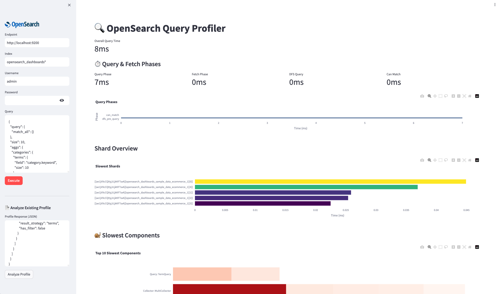

# OpenSearch Query Profiler

A Streamlit web application for analyzing OpenSearch query performance with interactive visualizations.

## Features

- **Live Query Execution**: Connect to OpenSearch clusters and execute queries with profiling
- **Profile Analysis**: Analyze existing profile responses from queries run elsewhere
- **Phase Timing**: View query & fetch phase breakdowns with `phase_took` metrics
- **Shard Performance**: Identify slowest performing shards
- **Component Analysis**: Drill down into queries, collectors, and aggregations
- **Interactive Charts**: Copyable labels and detailed breakdowns

## Interface



The app provides comprehensive query performance analysis with:
- Query & Fetch phase timing metrics
- Shard performance overview (top 10 slowest)
- Component-level analysis with interactive charts
- Detailed shard breakdowns with operation timings

## Installation

```bash
pip install streamlit requests plotly
streamlit run app.py
```

Access at `http://localhost:8501`

## Usage

### Live Profiling
1. Enter OpenSearch endpoint and index
2. Modify the query JSON as needed
3. Click "Execute" to run and analyze

### Analyze Existing Profile
1. Paste OpenSearch profile response JSON
2. Click "Analyze Profile"
3. View comprehensive performance breakdown

## Requirements

- Python 3.7+
- streamlit
- requests
- plotly

## License

MIT License